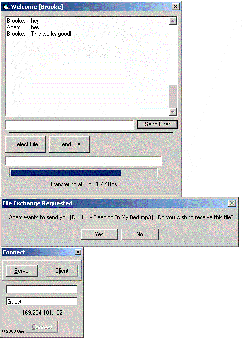



## The easiest way to SEND FILES via WINSOCK\!\!

### Description

My code allows you to send ANYFILE you want over a network (AND EVEN OVER THE INTERNET!) using Winsock! EVERY SINGLE LINE is commented on and is simple and easy to follow. Variables have names that match their function to simplify this project even more! The connection is based on my award winning "VERY EASY CHAT W/ Winsock *must see*". Enjoy the code!!!!! Please vote and comment as needed!
 
### More Info
 

             |
---                |---
**Submitted On**   |2001-01-01 11:05:28
**By**             |[AdamSpicer](https://github.com/Planet-Source-Code/PSCIndex/blob/master/ByAuthor/adamspicer.md)
**Level**          |Advanced
**User Rating**    |4.6 (23 globes from 5 users)
**Compatibility**  |VB 6\.0
**Category**       |[Internet/ HTML](https://github.com/Planet-Source-Code/PSCIndex/blob/master/ByCategory/internet-html__1-34.md)
**World**          |[Visual Basic](https://github.com/Planet-Source-Code/PSCIndex/blob/master/ByWorld/visual-basic.md)
**Archive File**   |[CODE\_UPLOAD13238112001\.zip](https://github.com/Planet-Source-Code/adamspicer-the-easiest-way-to-send-files-via-winsock__1-14003/archive/master.zip)

